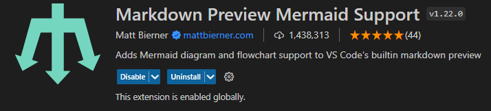
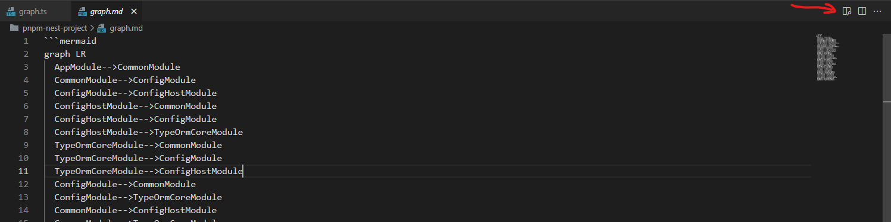
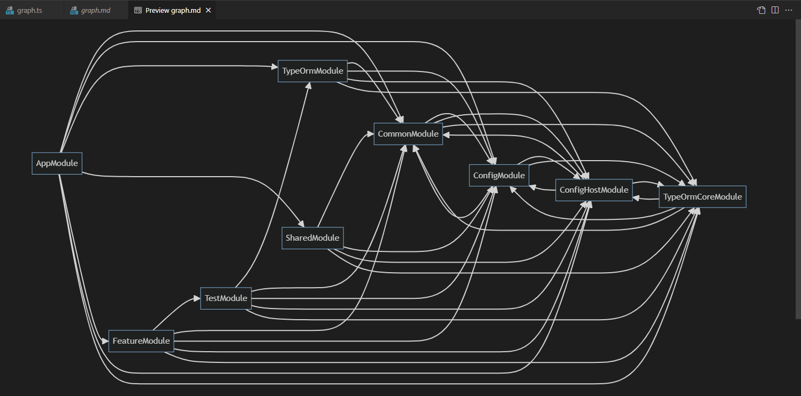

# NestJS-Module-Diagram

## Description

This module does a bit of a dive through the provided module and reads through the dependency tree from the point of entry given. It will find what a module `imports`, `provides`, has `controllers` for, and `exports` and will recursively search through the dependency tree until all modules have been scanned. For `providers` if there is a custom provider, the Spelunker will do its best to determine if Nest is to use a value, a class/standard, or a factory, and if a factory, what value is to be injected.

## Installation

Pretty straightforward installation:

```sh
npm i nestjs-module-diagram
yarn add nestjs-module-diagram
pnpm i nestjs-module-diagram
```

## Exploration Mode

### Exploration Usage

Much like the [`SwaggerModule`](https://github.com/nestjs/swagger), the `DiagramModule` is not a module that you register within Nest's DI system, but rather use after the DI system has done all the heavy lifting. Simple usage of the Spelunker could be like:

```ts
// ...
import { DiagramModule } from 'nestjs-module-diagram'; 

async function bootstrap() {
  const app = await NestFactory.create(AppModule);
  // const app = await NestFactory.createApplicationContext(AppModule);
  console.log(DiagramModule.explore(app));
  // ...
}
// ...
```

The `DiagramModule` will not get in the way of application bootstrapping, and will still allow for the server to listen.

#### Excluding modules

```ts
DiagramModule.explore(app, {
  // A list of regexes or predicate functions to apply over modules that will be ignored
  ignoreImports: [
    /^TypeOrmModule/i,
    (moduleName) => moduleName.endsWith('something'),
  ],
})
```

### Exploration Sample Output

Given the following source code

<details>
<summary>Sample code</summary>

```ts
// main.ts
import * as util from 'util'
import { NestFactory } from '@nestjs/core'
import { SpelunkerModule } from 'nestjs-spelunker'
import { AppModule } from './app.module'

async function bootstrap() {
  const app = await NestFactory.createApplicationContext(AppModule, { logger: false })
  console.log(
    util.inspect( SpelunkerModule.explore(app), { depth: Infinity, colors: true } )
  )
}
bootstrap();

// src/app.module.ts
import { Module, Injectable, Controller } from '@nestjs/common'

@Controller('hamsters')
export class HamstersController {}
@Injectable()
export class HamstersService {}

@Module({
  controllers: [HamstersController],
  providers: [HamstersService],
})
export class HamstersModule {}


@Controller('dogs')
export class DogsController {}
export class DogsService {}

@Module({
  controllers: [DogsController],
  providers: [
    {
      provide: DogsService,
      inject: ['someString'],
      useFactory: (str: string) => new DogsService(),
    },
    {
      provide: 'someString',
      useValue: 'my string',
    },
  ],
  exports: [DogsService],
})
export class DogsModule {}


@Controller('cats')
export class CatsController {}
@Injectable()
export class CatsService {}

@Module({
  controllers: [CatsController],
  providers: [CatsService],
})
export class CatsModule {}


export class AnimalsService {}
@Controller('animals')
export class AnimalsController {}

@Module({
  imports: [CatsModule, DogsModule, HamstersModule],
  controllers: [AnimalsController],
  providers: [
    {
      provide: AnimalsService,
      useValue: new AnimalsService(),
    }
  ],
  exports: [DogsModule],
})
export class AnimalsModule {}


@Module({
  imports: [AnimalsModule],
})
export class AppModule {}
```

</details>

it outputs this:

```js
[
  {
    name: 'AppModule',
    imports: [ 'AnimalsModule' ],
    providers: {},
    controllers: [],
    exports: []
  },
  {
    name: 'AnimalsModule',
    imports: [ 'CatsModule', 'DogsModule', 'HamstersModule' ],
    providers: { AnimalsService: { method: 'value' } },
    controllers: [ 'AnimalsController' ],
    exports: [ 'DogsModule' ]
  },
  {
    name: 'CatsModule',
    imports: [],
    providers: { CatsService: { method: 'standard' } },
    controllers: [ 'CatsController' ],
    exports: []
  },
  {
    name: 'DogsModule',
    imports: [],
    providers: {
      DogsService: { method: 'factory', injections: [ 'someString' ] },
      someString: { method: 'value' }
    },
    controllers: [ 'DogsController' ],
    exports: [ 'DogsService' ]
  },
  {
    name: 'HamstersModule',
    imports: [],
    providers: { HamstersService: { method: 'standard' } },
    controllers: [ 'HamstersController' ],
    exports: []
  }
]
```

In this example, `AppModule` imports `AnimalsModule`, and `AnimalsModule` imports `CatsModule`, `DogsModule`, and `HamstersModule` and each of those has its own set of `providers` and `controllers`.

## Graph Mode

Sometimes you want to visualize the module interdependencies, so you can better reason about them. The `DiagramModule` has a `graph` method that builds on the output of the `explore` method by generating a doubly-linked graph where each node represents a module and each edge a link to that module's dependencies or dependents. The `getEdges` method can traverse this graph from the root (or any given) node, recursively following dependencies and returning a flat array of edges. These edges can be easily mapped to inputs for graphing tools, such as [Mermaid](https://mermaid-js.github.io/mermaid/#/).

### Graphing Usage

Assume you have the sample output of the above `explore` section in a variable called tree. The following code will generate the list of edges suitable for pasting into a [Mermaid](https://mermaid-js.github.io/mermaid/#/) graph.

Create `src/graph.ts` file:
```ts
async function bootstrap(): Promise<void> {
    const app: INestApplication = await NestFactory.create(AppModule, { logger: false });
    const tree = DiagramModule.explore(app);
    const root = DiagramModule.graph(tree);
    const edges = DiagramModule.findGraphEdges(root);
    const mermaidEdges = edges.map(
        ({ from, to }) => `  ${from.module.name}-->${to.module.name}`,
    );
    fs.writeFileSync('graph.md', '```mermaid\ngraph LR\n' + mermaidEdges.join('\n') + '\n```');
    app.close();
    console.log(`\x1b[44m GRAPH \x1b[0m\x1b[34m Graph of module for review is already generated at graph.md !\x1b[0m`);
}

bootstrap().then();
```

Add `script` in your `package.json`:

```json
{
  "scripts": {
    "graph": "nest start --entryFile graph"
  }
}
```

Run `command`:

```shell
npm run graph
# OR
yarn graph
# OR
pnpm graph
```

Check content of `graph.md` file at your root project:

```
graph LR
  AppModule-->CommonModule
  CommonModule-->ConfigModule
  ConfigModule-->ConfigHostModule
  ....
  FeatureModule-->TypeOrmCoreModule
  AppModule-->ConfigHostModule
  AppModule-->TypeOrmCoreModule
```

#### You can use the result at: <a>`https://mermaid.live/edit`</a> (Do not copy line 1 and last line).

If you use vscode, just install `Markdown Preview Mermaid Support` extension: 



Open `graph.md` file and use this:



And enjoy your result:



The edges can certainly be transformed into formats more suitable for other visualization tools. And the graph can be traversed with other strategies.

## Debug Mode

Every now again you may find yourself running into problems where Nest can't resolve a provider's dependencies. The `DiagramModule` has a `debug` method that's meant to help out with this kind of situation.

### Debug Usage

Assume you have a `DogsModule` with the following information:

```ts
@Module({
  controller: [DogsController],
  exports: [DogsService],
  providers: [
    {
      provide: 'someString',
      useValue: 'something',
    },
    {
      provide: DogsService,
      inject: ['someString'],
      useFactory: (someStringInjection: string) => {
        return new DogsService(someStringInjection)
      },
    }
  ]
})
export class DogsModule {}
```

Now the `DiagramModule.debug()` method can be used anywhere with the `DogsModule` to get the dependency tree of the `DogsModule` including what the controller depends on, what imports are made, and what providers exist and their token dependencies.

```ts
async function bootstrap() {
  const dogsDeps = await DiagramModule.debug(DogsModule);
  const app = await NestFactory.create(AppModule);
  await app.listen(3000);
}
```

Because this method does not require the `INestApplicationContext` it can be used _before_ the `NestFactory` allowing you to have insight into what is being seen as the injection values and what's needed for the module to run.

### Debug Sample Output

The output of the `debug()` method is an array of metadata, imports, controllers, exports, and providers. The `DogsModule` from above would look like this:

```js
[
  {
    name: 'DogsModule',
    imports: [],
    providers: [
      {
        name: 'someString',
        dependencies: [],
        type: 'value',
      },
      {
        name: 'DogsService',
        dependencies: ['someString'],
        type: 'factory',
      },
    ],
    controllers: [
      {
        name: 'DogsController',
        dependencies: ['DogsService'],
      },
    ],
    exports: [
      {
        name: 'DogsService',
        type: 'provider',
      },
    ],
  },
];
```

### Debug Messages

If you are using the `debug` method and happen to have an invalid circular, the `DiagramModule` will write message to the log about the possibility of an unmarked circular dependency, meaning a missing `forwardRef` and the output will have `*****` in place of the `imports` where there's a problem reading the imported module.